# ML-Based IDS for Detecting IoT Attacks

> An interpretable, statistically-validated ML framework for detecting and classifying **15 attack categories** in Industrial IoT network traffic, with a novel use of **SHAP as a data leakage diagnostic**.

[](https://www.python.org/)
[](https://scikit-learn.org/)
[](https://xgboost.readthedocs.io/)
[](https://shap.readthedocs.io/)
[](LICENSE)

---

## Overview

This repository contains the implementation, experiments, and analysis for my M.Tech thesis on **explainable machine learning for IIoT intrusion detection**, conducted on the [Edge-IIoTset](https://ieeexplore.ieee.org/document/9751703) dataset (Ferrag et al., IEEE Access 2022).

Classical signature-based IDS cannot keep up with zero-day and polymorphic attacks targeting Industrial IoT infrastructure (PLCs, SCADA, smart grids). This project builds a unified ML pipeline that:

- Classifies network flows across **15 categories** (14 attack types + Normal)
- Achieves **99.36% binary accuracy** and **91.44% multi-class accuracy**
- Uses **SHAP** for per-prediction transparency *and* for catching dataset shortcuts
- Validates results with **5-fold stratified cross-validation** (σ = 4×10⁻⁴)

---

## Key Contributions

| # | Contribution | What's different |
|---|---|---|
| 1 | **Multi-class classification across 15 categories** | Most prior work stops at binary or ≤9 classes |
| 2 | **Random Forest-based feature selection** | Preserves semantic feature names — PCA destroys interpretability |
| 3 | **SHAP as a leakage diagnostic** (novel) | SHAP is universally framed as a transparency tool; this work uses it to detect dataset shortcuts |
| 4 | **Hierarchical binary → multi-class pipeline** | Deployment-aware design that matches real SOC architectures |

### The novelty in one paragraph

The main methodological contribution is **using SHAP as a validation tool rather than only an explanation tool**. An initial pipeline produced a suspect 100% accuracy. SHAP analysis revealed a single feature (`dns.qry.name.len`) with mean |SHAP| value of 9.09 — over 7× the next feature — acting as a near-perfect label shortcut. Investigation identified **6 leaky features** across DNS, MQTT, and HTTP headers. Dropping them brought accuracy to a realistic and defensible **99.36%**, with SHAP importance redistributed across semantically meaningful features. This use of explainability for dataset validation is rarely articulated in IDS literature.

---

## Dataset: Edge-IIoTset

- **Source:** Ferrag et al., IEEE Access 2022 — real testbed, not simulation
- **Focus:** IIoT protocols — MQTT, Modbus, HTTP
- **Scale used in this study:** 157,800 raw flows → 100,000 sampled → 96,731 clean × 39 features
- **Classes:** 15 (1 Normal + 14 attack types)

| Attack Class | Samples | Attack Class | Samples |
|---|---:|---|---:|
| Normal | 24,301 | DDoS_TCP | 10,247 |
| DDoS_UDP | 14,498 | Backdoor | 10,195 |
| DDoS_ICMP | 14,090 | Vulnerability_scanner | 10,076 |
| Ransomware | 10,925 | Port_Scanning | 10,071 |
| DDoS_HTTP | 10,561 | XSS | 10,052 |
| SQL_injection | 10,311 | Password | 9,989 |
| Uploading | 10,269 | MITM | 1,214 |
| | | Fingerprinting | 1,001 |

> **Note:** The Edge-IIoTset CSV is **not included** in this repository due to its size. Download it from the [official IEEE DataPort link](https://ieee-dataport.org/documents/edge-iiotset-new-comprehensive-realistic-cyber-security-dataset-iot-and-iiot-applications) and place `edge_iiot.csv` in the project root before running the scripts.

---

## Pipeline Architecture

The full preprocessing → training → evaluation flow runs in 13 stages. The critical ordering — **split → scale → SMOTE → feature-select** — prevents data leakage from the test set into the training pipeline.

```
1. Load Edge-IIoT  →  2. Sample 100K  →  3. Drop 16 ID/payload cols  →  4. SHAP leakage check (drop 6)
        ↓
5. Label-encode  →  6. NaN/duplicate cleanup  →  7. 80/20 stratified split  →  8. StandardScaler (fit on train)
        ↓
9. SMOTE (train only)  →  10. Feature selection (PCA-20 vs RF-FS-20)  →  11. Train 6 model variants
        ↓
12. 5-fold stratified CV  →  13a. SHAP analysis  |  13b. Multi-class XGBoost  |  13c. Hierarchical pipeline
        ↓
Output: 99.36% binary | 91.44% multi-class
```

---

## Dataset Overview

Class distribution across the 15 categories (Normal + 14 attack types):

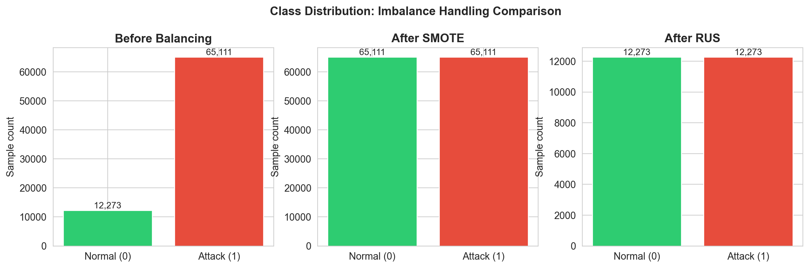

The dataset is moderately imbalanced — Normal traffic dominates, while MITM and Fingerprinting are minority classes. This motivates the SMOTE oversampling step in the training pipeline.

---

## Results

### Binary Classification

| Model | Accuracy | F1 | AUC |
|---|---:|---:|---:|
| **XGBoost + SMOTE** | **0.9936** | **0.9962** | 0.99+ |
| XGBoost + RF-FS | 0.9932 | 0.9959 | 0.99+ |
| Random Forest + RUS | 0.9931 | 0.9959 | 0.99+ |
| Random Forest + SMOTE | 0.9930 | 0.9958 | 0.99+ |
| XGBoost + PCA | 0.9888 | 0.9933 | 0.99+ |
| SVM (RBF) | 0.9512 | 0.9716 | 0.97+ |

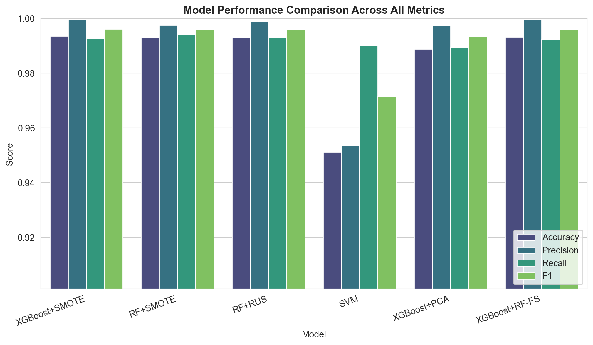

All tree-based ensembles converge near 99.3%; SVM lags by ~4% due to linear-separability limits in the feature space.

### Confusion Matrices (Binary)

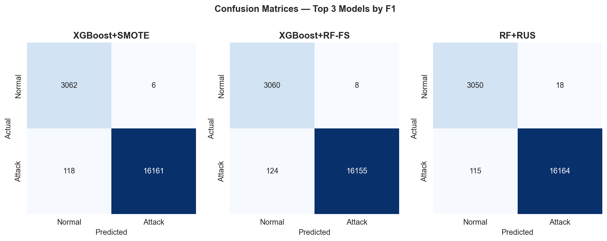

### ROC Curves

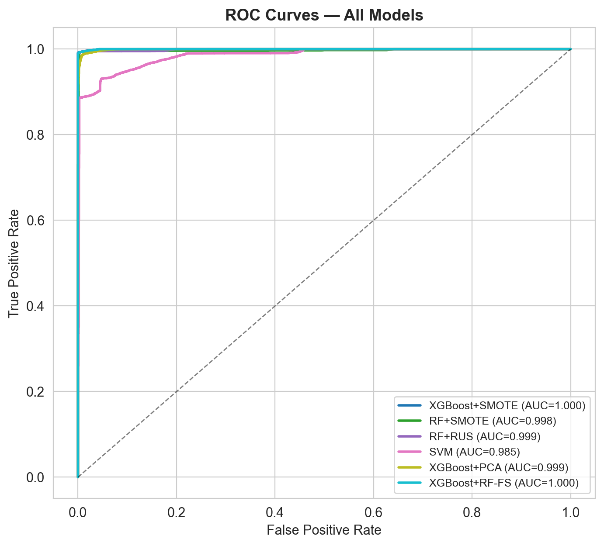

### 5-Fold Cross-Validation Stability

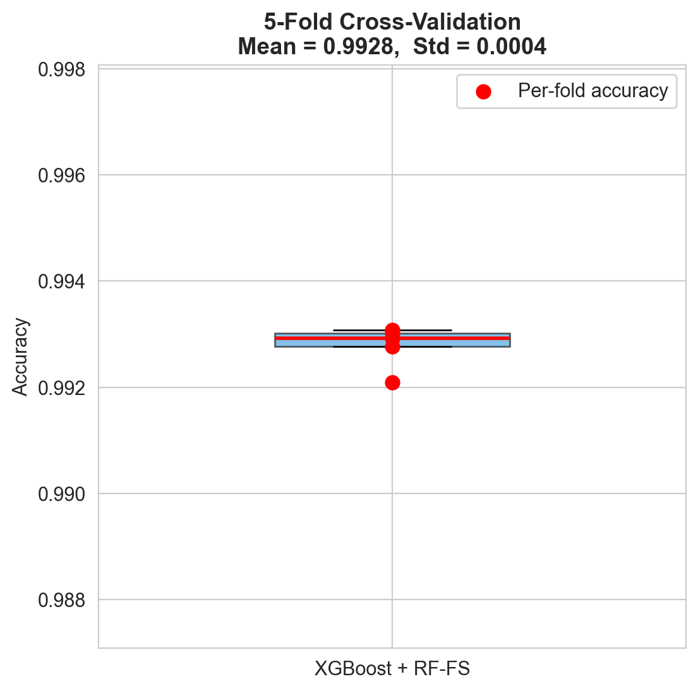

| Fold | 1 | 2 | 3 | 4 | 5 | **Mean ± Std** |
|---|---:|---:|---:|---:|---:|---:|
| Accuracy | 0.9931 | 0.9930 | 0.9921 | 0.9928 | 0.9929 | **0.9928 ± 0.0004** |

A standard deviation of 4×10⁻⁴ across folds confirms the pipeline is statistically stable — performance is not an artifact of a particular train/test split.

### Feature Importance

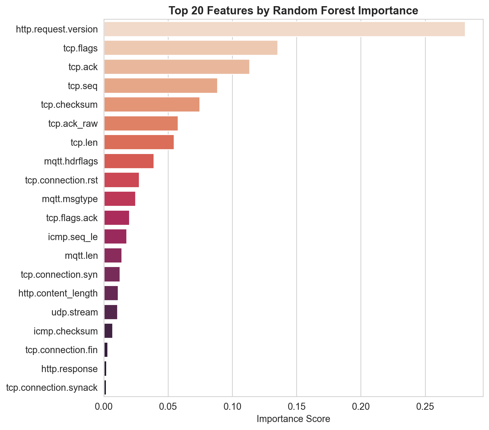

After dropping the 6 leaky features, importance is distributed across semantically meaningful TCP/UDP/MQTT fields — no single feature dominates.

---

## Explainability & Leakage Diagnosis (Novelty)

The strongest methodological contribution of this work: **using SHAP not just for transparency but as a leakage diagnostic.**

### Global SHAP importance

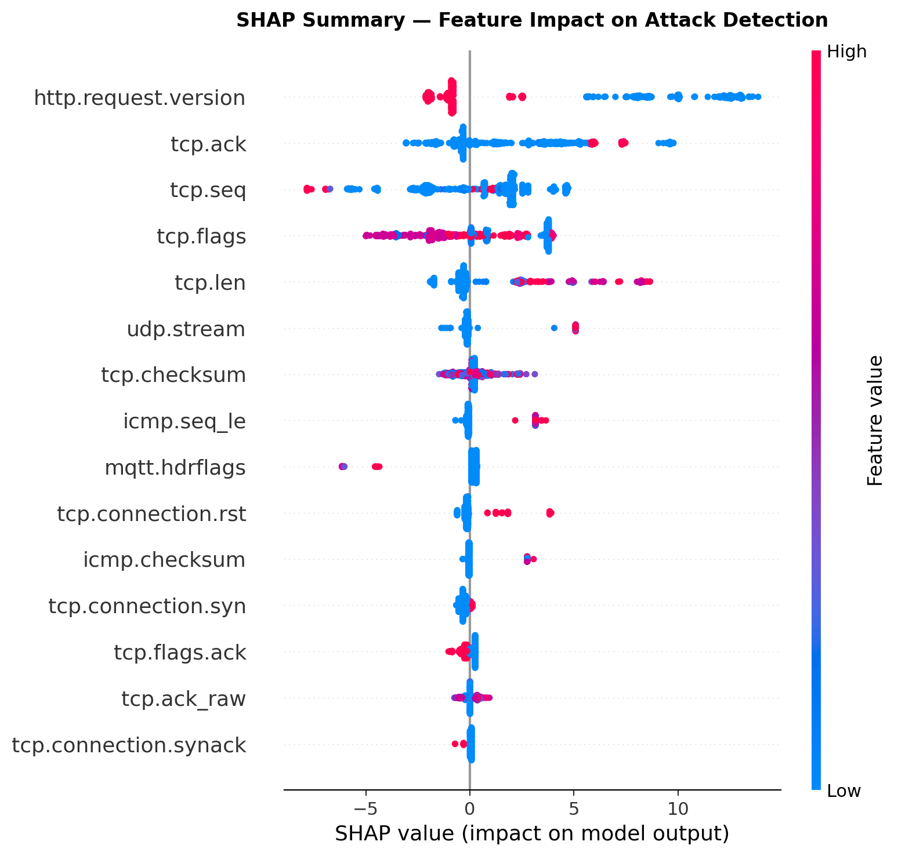

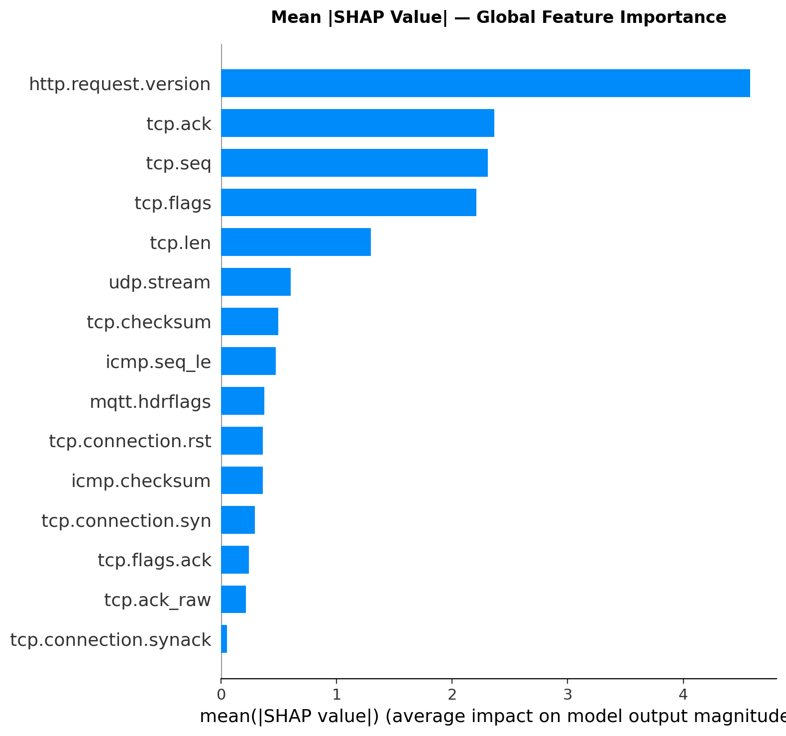

After leakage correction, SHAP importance is distributed across multiple TCP and UDP features. No single feature dominates — the model is making decisions based on a balanced, semantically meaningful feature set.

### Per-prediction SHAP force plot

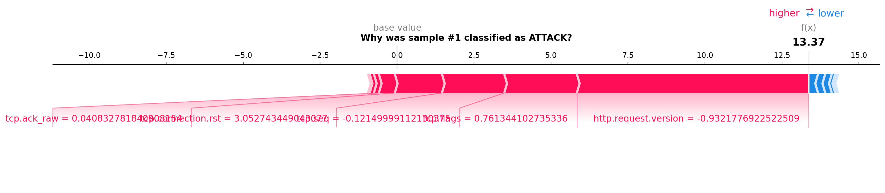

For any individual flagged flow, SHAP produces a per-feature contribution breakdown. This enables SOC analyst verification — every flagged flow comes with an explanation of *why* it was flagged.

> **The leakage story in one sentence:** initial SHAP analysis revealed `dns.qry.name.len` with a mean |SHAP| value of 9.09 — over 7× the next feature — acting as a near-perfect label shortcut. Six such shortcut features were identified and removed, dropping accuracy from a suspect 100% to a defensible 99.36%.

---

## Multi-Class Results (15 Classes)

| Metric | Value |
|---|---:|
| Overall accuracy | **91.44%** |
| Macro F1 | 0.8976 |
| Weighted F1 | 0.9147 |

### Multi-class confusion matrix

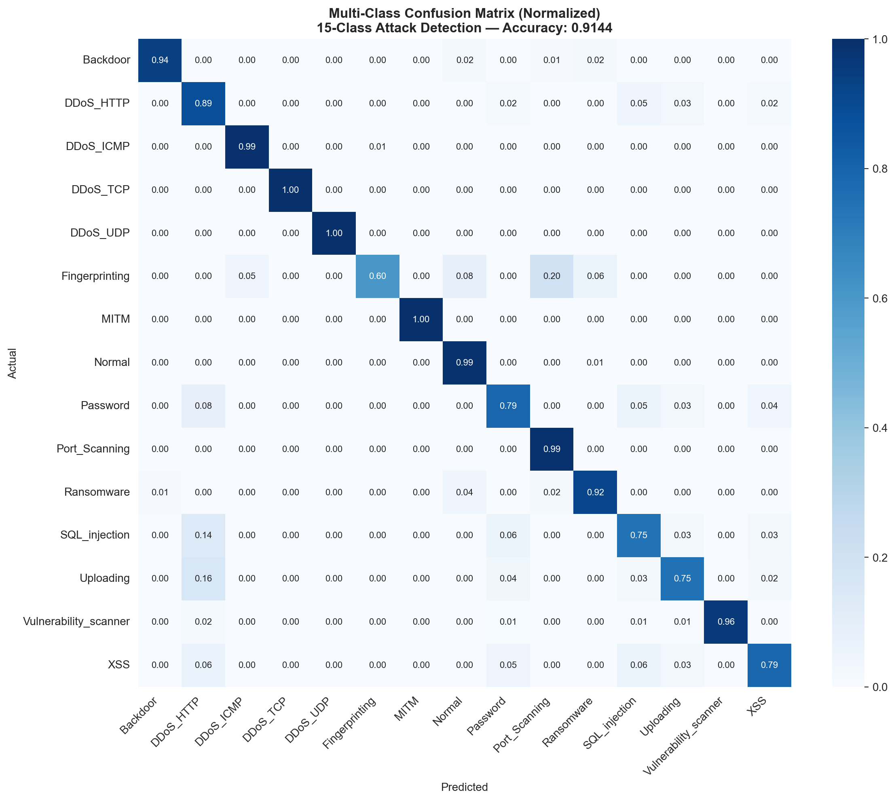

### Per-class F1 scores

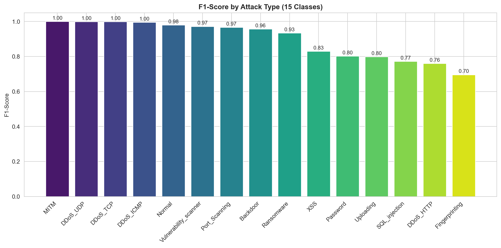

DDoS variants and Normal traffic are classified near-perfectly. MITM and Fingerprinting (the smallest classes) remain the hardest — a known consequence of class imbalance that future work will address with Borderline-SMOTE or class-weighted losses.

---

## Comparison with State-of-the-Art

| Study | Method | Binary Acc. | Multi-Class | CV | XAI |
|---|---|---:|---|:---:|:---:|
| Ferrag et al. (2022) | DT, RF, SVM ensemble | 96.0% | 5 classes | ✗ | ✗ |
| Mohy-Eddine et al. (2023) | XGBoost | 98.7% | ✗ | ✗ | ✗ |
| Aljuhani (2023) | DNN + ensemble | 99.1% | 7 classes | ✗ | ✗ |
| Tareq et al. (2024) | CNN-LSTM hybrid | 99.3% | ✗ | ✗ | ✗ |
| Friha et al. (2024) | Federated DL | — | 9 classes (92.4%) | ✓ | ✗ |
| **This work** | **XGB + RF-FS + SHAP** | **99.36%** | **15 classes (91.44%)** | **✓** | **✓** |

### Binary Classification

| Model | Accuracy | F1 | AUC |
|---|---:|---:|---:|
| **XGBoost + SMOTE** | **0.9936** | **0.9962** | 0.99+ |
| XGBoost + RF-FS | 0.9932 | 0.9959 | 0.99+ |
| Random Forest + RUS | 0.9931 | 0.9959 | 0.99+ |
| Random Forest + SMOTE | 0.9930 | 0.9958 | 0.99+ |
| XGBoost + PCA | 0.9888 | 0.9933 | 0.99+ |
| SVM (RBF) | 0.9512 | 0.9716 | 0.97+ |

### Multi-Class Classification (15 Classes)

| Metric | Value |
|---|---:|
| Overall accuracy | **91.44%** |
| Macro F1 | 0.8976 |
| Weighted F1 | 0.9147 |

### 5-Fold Cross-Validation (Best Pipeline)

| Fold | 1 | 2 | 3 | 4 | 5 | **Mean ± Std** |
|---|---:|---:|---:|---:|---:|---:|
| Accuracy | 0.9931 | 0.9930 | 0.9921 | 0.9928 | 0.9929 | **0.9928 ± 0.0004** |

A standard deviation of 4×10⁻⁴ across folds confirms the pipeline is statistically stable — performance is not an artifact of a particular train/test split.

### Comparison with State-of-the-Art

| Study | Method | Binary Acc. | Multi-Class | CV | XAI |
|---|---|---:|---|:---:|:---:|
| Ferrag et al. (2022) | DT, RF, SVM ensemble | 96.0% | 5 classes | ✗ | ✗ |
| Mohy-Eddine et al. (2023) | XGBoost | 98.7% | ✗ | ✗ | ✗ |
| Aljuhani (2023) | DNN + ensemble | 99.1% | 7 classes | ✗ | ✗ |
| Tareq et al. (2024) | CNN-LSTM hybrid | 99.3% | ✗ | ✗ | ✗ |
| Friha et al. (2024) | Federated DL | — | 9 classes (92.4%) | ✓ | ✗ |
| **This work** | **XGB + RF-FS + SHAP** | **99.36%** | **15 classes (91.44%)** | **✓** | **✓** |

---

## Repository Structure

```
ML-Based-IDS-for-Detecting-IoT-Attacks/
├── 00_check_data.py          # data inspection & sanity checks
├── 01_train_save.py          # 13-stage preprocessing + binary model training
├── 02_visualize.py           # confusion matrices, ROC curves, metric plots
├── 03_shap.py                # SHAP explainability + leakage diagnosis
├── 04_multiclass.py          # 15-class XGBoost training
├── 05_fix_and_rerun.py       # post-leakage-fix pipeline rerun
├── figures/                  # SHAP plots, confusion matrices, ROC curves
├── results/                  # metrics CSVs, classification reports
├── setup.sh                  # environment setup script
├── run_all.sh                # end-to-end pipeline runner
├── requirements.txt          # Python dependencies
└── README.md
```

> **Not tracked in this repo:**
> - `edge_iiot.csv` — the dataset (download separately, see above)
> - `models/` — trained `.pkl` files (regenerate by running `01_train_save.py`)
> - `venv/` — virtual environment

---

## Installation

```bash
# Clone the repo
git clone https://github.com/tusharsaini1413/ML-Based-IDS-for-Detecting-IoT-Attacks.git
cd ML-Based-IDS-for-Detecting-IoT-Attacks

# Create a virtual environment
python -m venv venv
source venv/bin/activate     # on Windows: venv\Scripts\activate

# Install dependencies
pip install -r requirements.txt
```

Or use the included setup script:

```bash
bash setup.sh
```

**Core dependencies:** `scikit-learn`, `xgboost`, `shap`, `imbalanced-learn`, `pandas`, `numpy`, `matplotlib`, `seaborn`.

---

## Usage

Make sure `edge_iiot.csv` is placed in the project root before running anything.

### Option 1 — Run the entire pipeline

```bash
bash run_all.sh
```

This sequentially executes all scripts and produces figures + results.

### Option 2 — Run scripts individually

**Inspect the raw dataset:**
```bash
python 00_check_data.py
```

**Train binary classifiers (6 pipeline variants) and save models:**
```bash
python 01_train_save.py
```

**Generate confusion matrices, ROC curves, and metric comparison plots:**
```bash
python 02_visualize.py
```

**Run SHAP explainability and leakage diagnosis:**
```bash
python 03_shap.py
```

**Train the 15-class multi-class XGBoost model:**
```bash
python 04_multiclass.py
```

**Apply leakage fixes and rerun the pipeline:**
```bash
python 05_fix_and_rerun.py
```

All outputs are saved to `figures/` and `results/`.

---

## Reproducibility

- **Random seed:** `42` for all stochastic operations (split, SMOTE, model init)
- **Hardware:** All experiments run CPU-only (MacBook Air M-series) — no GPU required
- **Inference cost:** Classical ensemble models with 200 estimators, max_depth=6 — suitable for edge gateway deployment

---

## Limitations & Future Work

This thesis is honest about what it does not yet cover:

- **Single dataset.** Generalization to TON-IoT, CICIoT2023, or N-BaIoT is unverified — planned cross-dataset validation.
- **Tabular features only.** No temporal sequencing within sessions; sequential models (LSTM, Transformer) are a natural next step.
- **No adversarial robustness testing.** FGSM/PGD evaluation and adversarial training planned for the final thesis phase.
- **No on-device deployment benchmarking.** Inference latency, memory footprint, and throughput on Raspberry Pi-class hardware not yet measured.
- **Multi-class imbalance.** MITM (1,214) and Fingerprinting (1,001) remain harder than majority classes — Borderline-SMOTE or class-weighted loss may help.

Planned for the final thesis phase: cross-dataset validation, adversarial robustness, edge benchmarking, quantized XGBoost / compact 1D-CNN variants, and conference paper submission (IEEE INDICON / IEEE Access).

---

## References

1. Ferrag, M. A., et al. "Edge-IIoTset: A new comprehensive realistic cyber security dataset of IoT and IIoT applications for centralized and federated learning." *IEEE Access*, 2022.
2. Lundberg, S., & Lee, S.-I. "A unified approach to interpreting model predictions." *NIPS*, 2017. (SHAP)
3. Chawla, N. V., et al. "SMOTE: synthetic minority over-sampling technique." *JAIR*, 2002.
4. Mohy-Eddine, M., et al. "An XGBoost-based intrusion detection system for IIoT networks." *Computers & Security*, 2023.
5. Tareq, I., et al. "Hybrid deep learning models for IoT intrusion detection." *Journal of Network and Computer Applications*, 2024.
6. Friha, O., et al. "FELIDS: Federated learning-based intrusion detection system for agricultural Internet of Things." *Journal of Parallel and Distributed Computing*, 2024.

---

## Author

**Tushar Saini** &nbsp;·&nbsp; M.Tech (MCL2025010)
🔗 [GitHub](https://github.com/tusharsaini1413)

---

## License

This project is released under the [MIT License](LICENSE). The Edge-IIoTset dataset is subject to its own license — see the original [paper](https://ieeexplore.ieee.org/document/9751703) for terms.
